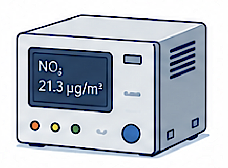
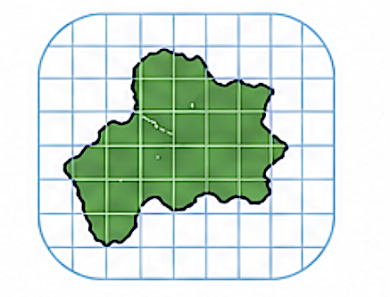
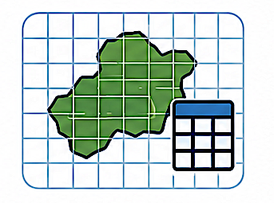
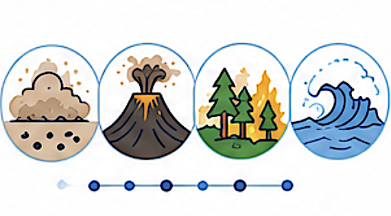
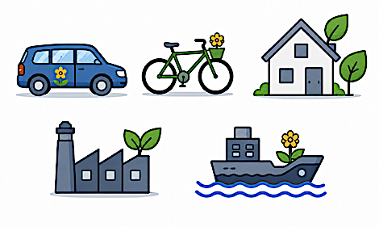

# Tables

Select a reference table below to view its structure and attributes.

```{note}
Tables displayed in dark grey and marked **REFERENCE ONLY** have no corresponding table in the Reporting data model. All other tables are common to the Reporting and Reference data models.
```

```{toctree}
:hidden:
:maxdepth: 1

Authority
MeasurementStation
SamplingPoint
SamplingPointLocation
SamplingProcess
ModelObjectiveEstimation
ObservationMeasurementStatistics
ObservationMeasurementInventory
MOEResultGrid
MOEResultInventory
ZoneGeometry
ZoneGeometryGrid
AssessmentRegimeZone
ComplianceAssessmentMethod
SpatialRepresentativeness
SRSGrid
SRSInventory
PollutionLevelAdjustment
CompliancePlanLink
Plan
PlanScenario
SourceApportionment
ScenarioMeasure
Measure
Documentation
ObservationMeasurementResultPNSD
```

<div class="reporting-table-grid">

<a class="reporting-table-card" href="Authority.html">
<span class="reporting-table-title">Authority</span>
<span class="reporting-table-image">

</span>
</a>

<a class="reporting-table-card" href="MeasurementStation.html">
<span class="reporting-table-title">MeasurementStation</span>
<span class="reporting-table-image">

</span>
</a>

<a class="reporting-table-card" href="SamplingPoint.html">
<span class="reporting-table-title">SamplingPoint</span>
<span class="reporting-table-image">

</span>
</a>

<a class="reporting-table-card" href="SamplingPointLocation.html">
<span class="reporting-table-title">SamplingPointLocation</span>
<span class="reporting-table-image">

</span>
</a>

<a class="reporting-table-card" href="SamplingProcess.html">
<span class="reporting-table-title">SamplingProcess</span>
<span class="reporting-table-image">

</span>
</a>

<a class="reporting-table-card" href="ModelObjectiveEstimation.html">
<span class="reporting-table-title">ModelObjectiveEstimation</span>
<span class="reporting-table-image">

</span>
</a>

<a class="reporting-table-card reference-only-table" href="ObservationMeasurementStatistics.html">
<span class="reporting-table-title">ObservationMeasurementStatistics</span>
<span class="reference-only-badge">REFERENCE ONLY</span>
<span class="reporting-table-image">

</span>
</a>

<a class="reporting-table-card reference-only-table" href="ObservationMeasurementInventory.html">
<span class="reporting-table-title">ObservationMeasurementInventory</span>
<span class="reference-only-badge">REFERENCE ONLY</span>
<span class="reporting-table-image">

</span>
</a>

<a class="reporting-table-card reference-only-table" href="MOEResultGrid.html">
<span class="reporting-table-title">MOEResultGrid</span>
<span class="reference-only-badge">REFERENCE ONLY</span>
<span class="reporting-table-image">

</span>
</a>

<a class="reporting-table-card reference-only-table" href="MOEResultInventory.html">
<span class="reporting-table-title">MOEResultInventory</span>
<span class="reference-only-badge">REFERENCE ONLY</span>
<span class="reporting-table-image">

</span>
</a>

<a class="reporting-table-card" href="ZoneGeometry.html">
<span class="reporting-table-title">ZoneGeometry</span>
<span class="reporting-table-image">

</span>
</a>

<a class="reporting-table-card reference-only-table" href="ZoneGeometryGrid.html">
<span class="reporting-table-title">ZoneGeometryGrid</span>
<span class="reference-only-badge">REFERENCE ONLY</span>
<span class="reporting-table-image">

</span>
</a>

<a class="reporting-table-card" href="AssessmentRegimeZone.html">
<span class="reporting-table-title">AssessmentRegimeZone</span>
<span class="reporting-table-image">

</span>
</a>

<a class="reporting-table-card" href="ComplianceAssessmentMethod.html">
<span class="reporting-table-title">ComplianceAssessmentMethod</span>
<span class="reporting-table-image">

</span>
</a>

<a class="reporting-table-card" href="SpatialRepresentativeness.html">
<span class="reporting-table-title">SpatialRepresentativeness</span>
<span class="reporting-table-image">

</span>
</a>

<a class="reporting-table-card reference-only-table" href="SRSGrid.html">
<span class="reporting-table-title">SRSGrid</span>
<span class="reference-only-badge">REFERENCE ONLY</span>
<span class="reporting-table-image">

</span>
</a>

<a class="reporting-table-card reference-only-table" href="SRSInventory.html">
<span class="reporting-table-title">SRSInventory</span>
<span class="reference-only-badge">REFERENCE ONLY</span>
<span class="reporting-table-image">

</span>
</a>

<a class="reporting-table-card" href="PollutionLevelAdjustment.html">
<span class="reporting-table-title">PollutionLevelAdjustment</span>
<span class="reporting-table-image">

</span>
</a>

<a class="reporting-table-card" href="CompliancePlanLink.html">
<span class="reporting-table-title">CompliancePlanLink</span>
<span class="reporting-table-image">

</span>
</a>

<a class="reporting-table-card reference-only-table" href="Plan.html">
<span class="reporting-table-title">Plan</span>
<span class="reference-only-badge">REFERENCE ONLY</span>
<span class="reporting-table-image">

</span>
</a>

<a class="reporting-table-card" href="PlanScenario.html">
<span class="reporting-table-title">PlanScenario</span>
<span class="reporting-table-image">

</span>
</a>

<a class="reporting-table-card" href="SourceApportionment.html">
<span class="reporting-table-title">SourceApportionment</span>
<span class="reporting-table-image">

</span>
</a>

<a class="reporting-table-card" href="ScenarioMeasure.html">
<span class="reporting-table-title">ScenarioMeasure</span>
<span class="reporting-table-image">

</span>
</a>

<a class="reporting-table-card" href="Measure.html">
<span class="reporting-table-title">Measure</span>
<span class="reporting-table-image">

</span>
</a>

<a class="reporting-table-card" href="Documentation.html">
<span class="reporting-table-title">Documentation</span>
<span class="reporting-table-image">

</span>
</a>

<a class="reporting-table-card" href="ObservationMeasurementResultPNSD.html">
<span class="reporting-table-title">ObservationMeasurementResultPNSD</span>
<span class="reporting-table-image">

</span>
</a>

</div>